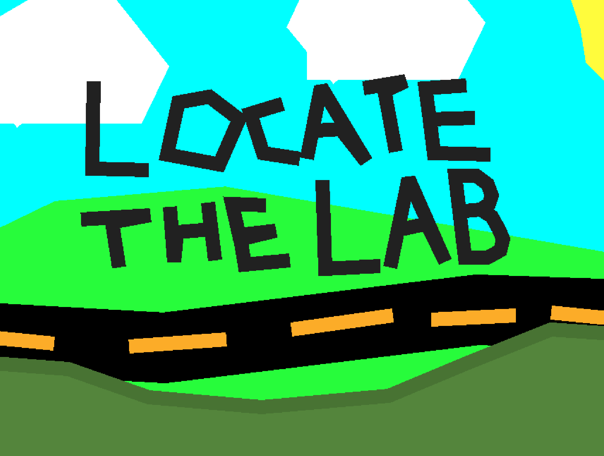

# Loacate the Lab



## Description
A short and funny game where you click a option and something happens. There will be be a few endings when the game is done. this game its made 99% of lines because when we started working on the game we were on a mac because my PC wasn't working and we had no internet. there was no image editing software so we made it all in the Godot editor.

## Gameplay
- **Genre:** (Point and Click, funny, Story)
- **Engine:** Godot (version 4.3)
- **Language:** (GDScript)
- **Current Platforms:** (Windows, Linux, macOS, Web)

## Installation
### Download
- [Itch.io](https://belugastudios.itch.io/locate-the-lab)
- [GitHub Releases](https://github.com/Beluga-Studios/Locate-the-Lab/releases)

### Running from Source
1. Install [Godot Engine](https://godotengine.org/) (version 4.3 Recomended).
2. Clone the repository:
   ```sh
   git clone https://github.com/Beluga-Studios/Locate-the-Lab
   ```
   Or Click Code>Download ZIP Then extract the ZIP folder
3. Open the project in Godot.
4. Click **Run** to play!

## Controls
- Click a button when it comes up on the screen with the mouse.
- If you Fail press retry in the bottom left

## Contributing
1. Fork the repository.
2. Create a new branch (`git checkout -b feature-name`).
3. Commit your changes (`git commit -m 'Add feature'`).
4. Push to the branch (`git push origin feature-name`).
5. Create a pull request.

## License
This project is licensed under the [MIT License](LICENSE.md).

## Contact
- [Discord](https://discord.com/invite/eMVXBAxwrX)
- [Itch.io](https://beluga-studios.itch.io)
- [YouTube](https://youtube.com/@Beluga-Studios)

## Acknowledgments
- Eddie W for the whole idea of the gamwe
